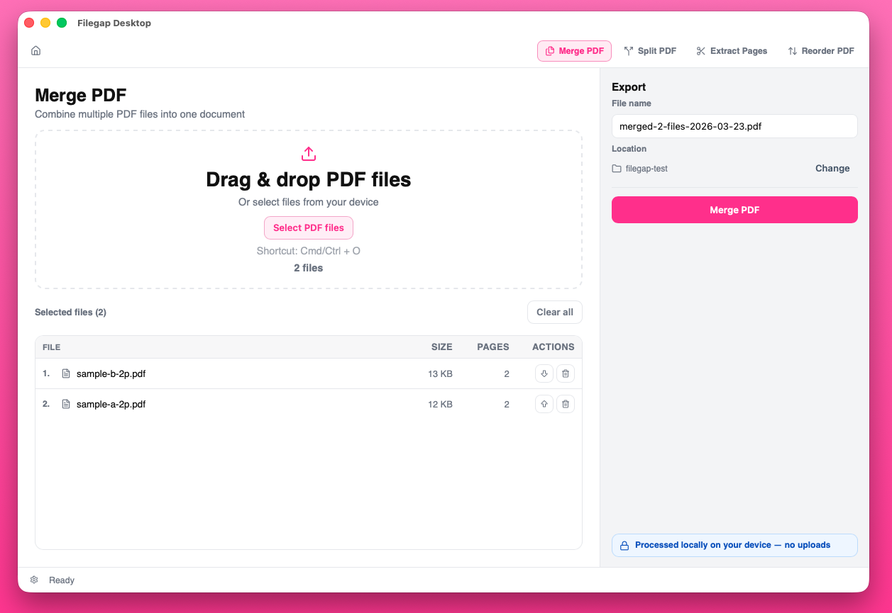

# Filegap


Privacy-first PDF tools that run locally.

Your files never leave your device.

[Try Filegap Online](https://www.filegap.app) | [Download Desktop](#install-desktop-homebrew-cask-community-preview) | [Install CLI](#install-cli-homebrew)

## Screenshot



## What Is Filegap?

Filegap is an open-source PDF toolkit for common document tasks: merging, splitting, extracting, reordering, compressing, converting, and inspecting PDFs.

It is built around local-first processing. The web app runs PDF operations in your browser, the desktop app runs on your computer, and the CLI is designed for local automation.

Filegap is for people who need practical PDF tools without uploading files or creating an account.

Repository: <https://github.com/filegap/filegap>

## Why Filegap?

Most online PDF tools require uploading files to a server before they can merge, split, compress, or convert them. That can be uncomfortable for everyday documents such as contracts, invoices, tax documents, resumes/CVs, medical records, or other personal files.

Filegap takes a different approach: PDF processing happens locally, either in the browser, in the desktop app, or through the CLI. The goal is simple, credible no upload PDF tools that are useful for quick tasks and predictable enough for sensitive documents.

Filegap does not claim to make every PDF workflow risk-free. It avoids the main tradeoff of upload-based tools by keeping user files on the device during supported PDF operations.

## Key Principles

- No upload-based PDF processing
- Local browser processing for the web app
- No account required for web tools
- No server-side persistence of user PDFs
- Open-source project
- CLI and desktop options for local workflows

## Features

Filegap currently supports these local PDF tools:

- Merge multiple PDFs into one document
- Split a PDF into selected ranges
- Extract selected pages
- Reorder pages
- Compress PDFs with quality presets
- Optimize PDF structure without intentional quality reduction
- Convert PDF pages to images, including JPG where supported
- Extract embedded images from PDFs
- Inspect PDF metadata and structure
- Preview chained operations in the Workflow Builder

## Product Surfaces

### Web App

The web app is a browser-based PDF tools experience at <https://www.filegap.app>.

- Runs in the browser
- Processes supported PDF operations locally
- Requires no uploads
- Requires no account for web tools

### CLI

The CLI is for developers, terminal users, and automation.

- Runs locally
- Supports pipe-first workflows
- Reads from file paths or `stdin`
- Writes to `stdout` by default, with optional file output

### Desktop App

The desktop app is an offline-friendly local PDF workflow.

- Runs on your computer
- Uses a local file picker and save dialogs
- Integrates with the shared Rust PDF core
- Distributed through a community preview channel

## Privacy Model

Filegap is designed as a local PDF tools project, not a cloud PDF processing service.

- The web app architecture is backend-free for PDF operations.
- Browser processing uses local `ArrayBuffer` and `Blob` data.
- The CLI and desktop app process files locally.
- No network requests are allowed during PDF processing across web, CLI, and desktop workflows.
- User PDFs must not be uploaded, persisted server-side, or inspected by a backend service.

## Web Guardrails

For the web channel, PDF processing must remain strictly client-side.

- No API routes for PDF manipulation
- No file upload endpoint for processing
- No server-side persistence of user PDFs
- No telemetry that includes file content or extracted text

Any proposal that introduces server-side PDF processing is out of scope for this project.

## Install CLI (Homebrew)

Tap first and then install:

```bash
brew tap filegap/filegap
brew install filegap
```

Or install directly from tap without a separate tap step:

```bash
brew install filegap/filegap/filegap
```

Update the CLI:

```bash
brew update
brew upgrade filegap
```

Quick sanity checks:

```bash
filegap --version
filegap --help
filegap support
```

Examples:

```bash
filegap merge a.pdf b.pdf > merged.pdf
cat input.pdf | filegap extract --pages 2-4 > out.pdf
cat input.pdf | filegap reorder --pages 3,1,2 > reordered.pdf
filegap split input.pdf --pages 1-3 > part.pdf
filegap split input.pdf --pages 1-2,5 --format zip > parts.zip
filegap optimize input.pdf > optimized.pdf
filegap compress input.pdf --preset balanced > compressed.pdf
filegap extract-images input.pdf > images.zip
filegap info input.pdf
filegap info input.pdf --json
```

Pipe-first chaining:

```bash
cat input.pdf \
| filegap extract --pages 1-5 \
| filegap compress --preset balanced \
| filegap reorder --pages 5,4,3,2,1 \
> final.pdf
```

## Install Desktop (Homebrew Cask, Community Preview)

Install from the official tap:

```bash
brew tap filegap/filegap
brew install --cask filegap-desktop
```

Update Filegap Desktop:

```bash
brew update
brew upgrade --cask filegap-desktop
```

Channel notes:

- Desktop Homebrew is currently a community/developer preview channel.
- Until Apple signing/notarization is enabled, macOS Gatekeeper prompts can occur.
- PDF processing remains fully local: no uploads and no server-side handling.

If macOS reports the app as damaged on community builds, remove quarantine and retry:

```bash
xattr -dr com.apple.quarantine "/Applications/Filegap Desktop.app"
open "/Applications/Filegap Desktop.app"
```

## Development Setup

Use the existing scripts and workflows in this repository. The sections below are for contributors who want to run or modify Filegap locally.

### Repository Structure

```text
filegap/
├─ crates/
│  ├─ core/      # shared Rust PDF domain logic
│  └─ cli/       # CLI wrapper around core operations
├─ apps/
│  ├─ web/       # web app (browser-local processing)
│  └─ desktop/   # Tauri desktop app (Rust core integration)
├─ shared/
│  └─ design/    # shared design tokens and foundations for web + desktop
├─ docs/
└─ testdata/
```

### Branch Model

- `dev` is the default branch for day-to-day development.
- `main` is the stable branch.
- Recommended working branches:
  - `feature/<name>` from `dev`
  - `fix/<name>` from `dev`
  - `hotfix/<name>` from `main`
  - `release/<version>` from `dev`

Normal development should integrate toward `dev`, and only stable code should be promoted to `main`.

### Quick Start (Rust)

Requirements:

- Rust stable toolchain

Build workspace:

```bash
cargo build
```

Run CLI from source:

```bash
cargo run -p filegap-cli --bin filegap -- --help
```

Source-run examples:

```bash
cargo run -p filegap-cli --bin filegap -- merge a.pdf b.pdf > merged.pdf
cat input.pdf | cargo run -p filegap-cli --bin filegap -- extract --pages 2-4 > out.pdf
cat input.pdf | cargo run -p filegap-cli --bin filegap -- reorder --pages 3,1,2 > reordered.pdf
cargo run -p filegap-cli --bin filegap -- split input.pdf --pages 1-3 > part.pdf
cargo run -p filegap-cli --bin filegap -- split input.pdf --pages 1-2,5 --format zip > parts.zip
cargo run -p filegap-cli --bin filegap -- optimize input.pdf > optimized.pdf
cargo run -p filegap-cli --bin filegap -- compress input.pdf --preset balanced > compressed.pdf
cargo run -p filegap-cli --bin filegap -- extract-images input.pdf > images.zip
cargo run -p filegap-cli --bin filegap -- info input.pdf
cargo run -p filegap-cli --bin filegap -- info input.pdf --json
```

Source-run chaining:

```bash
cat input.pdf \
| cargo run -p filegap-cli --bin filegap -- extract --pages 1-5 \
| cargo run -p filegap-cli --bin filegap -- compress --preset balanced \
| cargo run -p filegap-cli --bin filegap -- reorder --pages 5,4,3,2,1 \
> final.pdf
```

### Development Shortcuts

Common commands can be run from the repository root with `dev.sh`:

```bash
./dev.sh server
./dev.sh app
./dev.sh cli:run --help
./dev.sh test
```

Run `./dev.sh --help` for the full command list.

### Quick Start (Web)

The web app is in `apps/web` and runs fully local in the browser.

```bash
cd apps/web
npm install
npm run dev
```

Current web app features include browser-local PDF tools, including embedded image extraction for supported JPEG and JPEG 2000 image XObjects.

Design foundations for both web and desktop share a common token source in `shared/design/tokens.css`.

### Quick Start (Desktop MVP)

The desktop app lives in `apps/desktop` and uses Tauri + React with direct calls to `crates/core` for PDF structure operations and local browser rendering for page image export.

Requirements:

- Rust stable toolchain
- Node.js 20+

Run in development:

```bash
cd apps/desktop
npm install
npm run tauri:dev
```

Current desktop MVP includes:

- Desktop home page
- Merge PDF tool
- Split PDF tool
- Extract Pages tool
- In-memory Extract page thumbnails and assisted selection (Select all, Odd, Even, First page)
- Reorder PDF tool
- Optimize PDF tool
- Compress PDF tool with `low`, `balanced`, and `strong` presets
- PDF to Images tool for local JPEG/PNG page export
- Extract Images tool for embedded PDF image assets
- Local file picker + save dialog
- Rust-side PDF commands powered by `filegap_core`

Desktop UI foundations and recurring tool patterns align with the shared design system documented in `docs/design-system.md`, `docs/ui-components.md`, and `docs/desktop.md`.

Desktop distribution planning lives in [`docs/desktop-distribution-roadmap.md`](docs/desktop-distribution-roadmap.md), including channel strategy, store positioning, and a gap analysis against the current codebase.
Desktop community release workflow details are documented in [`docs/desktop-release.md`](docs/desktop-release.md).

### Automatic Commit Checks

This repository ships with a versioned Git `pre-commit` hook in `.githooks/pre-commit`.

Once enabled locally, every commit automatically runs the relevant checks based on staged files:

- changes in `apps/web/**` run `npm run build` and `npm run test` in `apps/web`
- changes in `apps/desktop/**` run `npm run build` and `npm run test` in `apps/desktop`
- changes in `shared/design/tokens.css` run both web and desktop checks

Enable hooks for your local clone with:

```bash
git config core.hooksPath .githooks
chmod +x .githooks/pre-commit
```

## Status

`v0.1` is feature-complete on CLI for `merge`, `extract`, `split`, `reorder`, and `info`, with automated tests.

Web and desktop apps have local production flows for `merge`, `split`, `extract`, `reorder`, `optimize`, `compress`, `PDF to Images`, `Extract Images`, and Workflow Builder terminal exports.
